[](https://fly.io/)[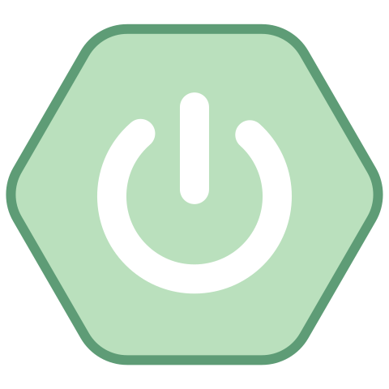](https://spring.io/projects/spring-boot)

This is a simple Spring Boot App for the purposes of demonstrating how to deploy it to fly.io. 

Fly.io is a cloud platform and application deployment service that specializes in running applications close to users via an edge network.

- [TL;DR](#tldr)
- [Prerequisites](#prerequisites)
  - [Windows Subsystem for Linux WSL](#windows-subsystem-for-linux-wsl)
  - [Installing flyctl](#installing-flyctl)
- [Coding the Spring Boot application](#coding-the-spring-boot-application)
- [Deploying to fly.io](#deploying-to-flyio)
  - [Create the Dockefile](#create-the-dockefile)
  - [Clean up the first deployment](#clean-up-the-first-deployment)
  - [Create a Volume](#create-a-volume)
  - [Bind our Spring Boot App to 0.0.0.0](#bind-our-spring-boot-app-to-0000)
  - [Redeploy the app with changes](#redeploy-the-app-with-changes)
  - [Success!](#success)
- [More tweaking](#more-tweaking)
  - [Setting Environment Variables](#setting-environment-variables)
  - [Lower the memory we are using on the fly.io machines](#lower-the-memory-we-are-using-on-the-flyio-machines)
- [Adding some metrics](#adding-some-metrics)
  - [Dependencies for metrics](#dependencies-for-metrics)
  - [The code to collect the metrics](#the-code-to-collect-the-metrics)
  - [Application properties to enable metrics](#application-properties-to-enable-metrics)
  - [Expose our metrics to fly.io](#expose-our-metrics-to-flyio)
  - [Seeing our simple metric](#seeing-our-simple-metric)
- [Some common fly.io CLI commands](#some-common-flyio-cli-commands)

## TL;DR

It's pretty easy to deploy a Spring Boot app to fly.io's platform.  There are a few caveats.

1. The Spring property server.address needs to be set to 0.0.0.0 in application.properties or application.yaml
2. When launching for the first time and a Volume(Persistent storage) is not defined in `fly.toml` 2 fly machines will be created by default. See fly.io's documentation about it [here](https://fly.io/docs/reference/app-availability/#redundancy-by-default-on-first-deploy)
3. Your Spring Boot app must be in a Docker image, which will be deployed in a Docker container on fly.io's infrastructure.
4. fly.io's proxy will send a `SIGINT` signal to the running process when it detects there is excess capacity.

What follows below is details that involve various commands and their outputs that were used to deploy a simple Spring Boot App with 1 REST endpoint.

## Prerequisites

Make sure you have the the tools/JDKs listed below installed and have signed up for fly.io account.

- Gradle
- Java 21 JDK
- VSCode or other IDE
- flyctl (fly.io CLI tool)
- Docker

The easiest way to install and manage these tools/JDKs is to use [SDKMAN!](https://sdkman.io/).

### Windows Subsystem for Linux WSL

On a Windows 10 machine SDKMAN suggests installing [WSL](https://learn.microsoft.com/en-us/windows/wsl/install) aka Windows Subsystem for Linux. 

There is a nice guide on medium [here](https://medium.com/@pravinpreneur/how-to-modernize-java-development-environment-using-vs-code-and-wsl2-to-improve-productivity-1c9681390170) about how to setup a dev environment with WSL.

An good additional package to install for WSL is [wslu](https://www.wslutiliti.es/wslu/install.html). It is a collection of utilities designed for WSL, including wslview. wslview allows you to open the default browser on Windows from the Ubuntu command line. Sometimes some cli tools will want to open a browser window for authorization purposes. 

In `.bashrc` add the line below
```
export BROWSER=wslview
```


### Installing flyctl 

Execute the command below in a WSL terminal
```
curl -L https://fly.io/install.sh | sh
```
[Installation Docs](https://fly.io/docs/hands-on/install-flyctl/)

## Coding the Spring Boot application

Head over to [Spring Initializr](https://start.spring.io/) website and select the dependencies you need. For this simple greeting application I selected only Spring Web and Lombok.

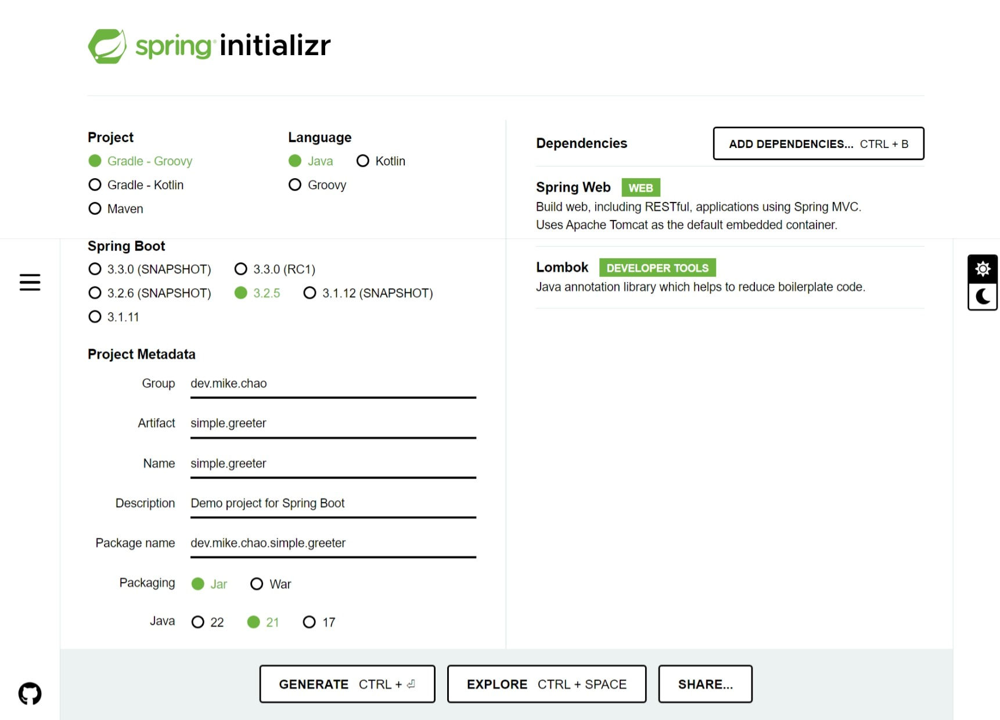

I implemented a simple rest controller, [GreetingController.java](./src/main/java/dev/mike/chao/simple/greeter/GreetingController.java) that just returns a different `Greeting` object on the "/" endpoint based on the number of times it was called.

The `Greeting` beans are defined in [SpringConfig.java](./src/main/java/dev/mike/chao/simple/greeter/SpringConfig.java) and then they are `@Autowired` into [GreetingController.java](./src/main/java/dev/mike/chao/simple/greeter/GreetingController.java) using `@Qualifier' to distinguish between the two different implementation of the interface [Greeting.java](./src/main/java/dev/mike/chao/simple/greeter/Greeting.java)

Run the app from [Application.java](./src/main/java/dev/mike/chao/simple/greeter/Application.java)
The output should be like this

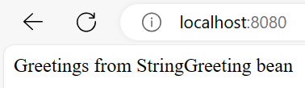

Hit refresh

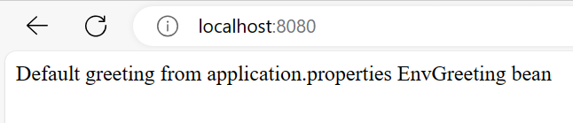

## Deploying to fly.io

fly.io does NOT directly support deploying a Spring Boot application. However it does support deploying via Dockerfile.

### Create the Dockefile

In the project root directory create a file name Dockfile and add the following.
```
## alpine linux with JRE 
FROM eclipse-temurin:21-jre-alpine 
 
## create a nonroot user and group 
RUN addgroup -S spring && adduser -S spring -G spring 
 
## copy the spring jar
## Gradle puts the built fat jar in build/libs
## maven puts it in target/ 
COPY build/libs/*.jar /opt/myApp.jar 
 
## set the nonroot user as the default user 
USER spring:spring 
 
## set the working directory 
WORKDIR /opt 
 
ENTRYPOINT ["java", "-jar", "myApp.jar"] 
 
## expose the port to the external world 
EXPOSE 8080 
```

Once the Dockerfile has been created. Make sure the executable jar file is built. Using Gradle the command is
```
./gradlew clean bootJar
```

We are almost ready to deploy to fly.io. We just need to generate `fly.toml` which is a configuration file used by fly.io.
Run the following command from the project root directory to generate it.
```
fly launch --no-deploy
```
A summary of the defaults chosen will be displayed on the command line allowing you to edit them.
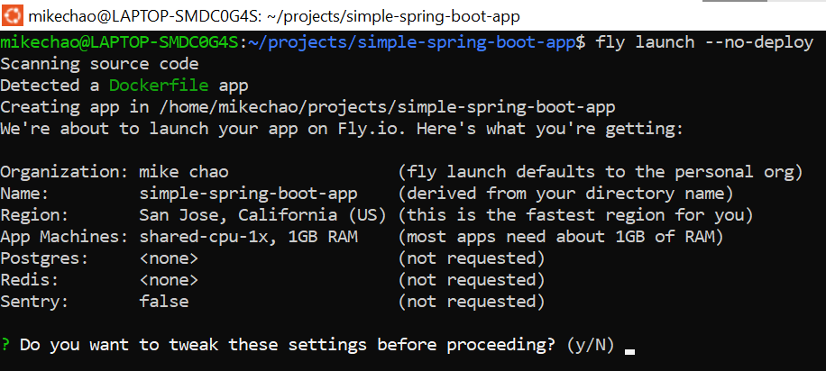

Accept the defaults as we can change them later by editing the `fly.toml` file.

The next question it will ask is if you want to create a `.dockerignore` file from `.gitignore` file. Yes should be the answer as it allows you to specify a list of files and directories that Docker should ignore during the build process.
<br>⚠️⚠️⚠️<br>
However if you look in `.dockerignore` you will notice that `**/build` is listed as an entry. This will cause a problem when we try to build the image locally before deploying to fly.io. So remove this entry
<br>⚠️⚠️⚠️

With all that out of the way deploy to fly.io using the following command to build the Docker image locally and then push it to fly.io for it to be deployed
```
fly deploy --local-only
```
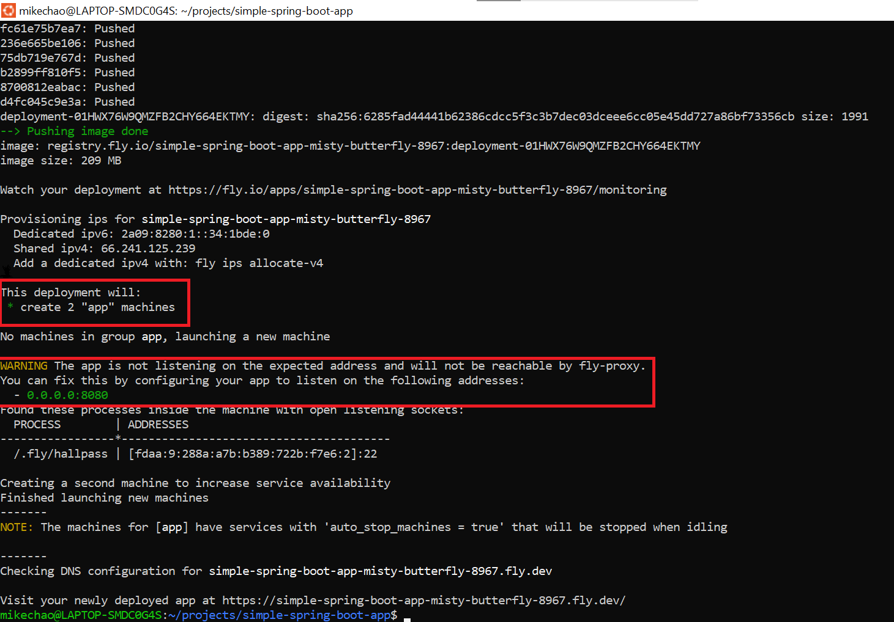

⚠️⚠️⚠️⚠️⚠️⚠️<br>
Notice the lines highlighted by the first red box. This is the default setting in fly.io when there are no Volumes attached. See their documentation [here](https://fly.io/docs/reference/app-availability/#redundancy-by-default-on-first-deploy). Volumes offer persistent storage for our deploy app. 
<br>⚠️⚠️⚠️⚠️⚠️⚠️<br>

⚠️⚠️⚠️⚠️⚠️⚠️<br>
The second red box is telling us that we will not be able to reach our Spring Boot Application because it is not bound to the right server address. This can be fixed by adding server.address=0.0.0.0 in application.properties
<br>⚠️⚠️⚠️⚠️⚠️⚠️<br>

### Clean up the first deployment
That is not what we want as it takes up more resources than needed and exceeds the free resources including in every fly.io plan. 

List the fly machines created. From the project root directory
```
fly machine list
```
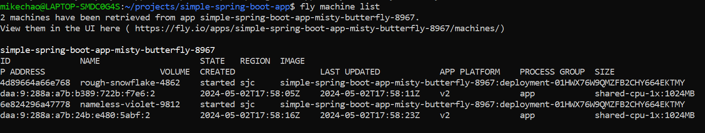
The key thing to note here is the ID column.

Stop the 2 machines created by repeating the command
```
fly machine stop $ID
```

Destroy the 2 machines 
```
mikechao@LAPTOP-SMDC0G4S:~/projects/simple-spring-boot-app$ fly machine destroy $ID
machine 4d89664a66e768 was found and is currently in stopped state, attempting to destroy...
4d89664a66e768 has been destroyed
```

List the app that are deployed
```
fly app list
```
Output is similar to this
```
mikechao@LAPTOP-SMDC0G4S:~/projects/simple-spring-boot-app$ fly app list
NAME                                            OWNER           STATUS          LATEST DEPLOY
simple-spring-boot-app                          personal        pending
simple-spring-boot-app-misty-butterfly-8967     personal        suspended
```

Destroy the app, from project root directory
```
fly app destroy simple-spring-boot-app
```
Destroy the redundancy copy
```
fly app destroy simple-spring-boot-app-misty-butterfly-8967
```

### Create a Volume

fly.io Volume documentation can be found [here](https://fly.io/docs/reference/volumes/)

In the `fly.toml` file add the following section to create a volume
```
[mounts]
  source="myapp_data"
  destination="/data"
```

### Bind our Spring Boot App to 0.0.0.0

In application.properties add the following line.
```
server.address=0.0.0.0
```

### Redeploy the app with changes

1. Build the executable bootJar to include changes in application.properties
```
./gradlew clean bootJar
```
2. Deploy to fly.io again
```
fly launch --local-only
```
We use the launch command here instead of deploy because we cleaned up the first deployment so fly.io doesn't know about it. This time I chose to customize the defaults and change the app name to simple-greeting-app.<br>

Launch output
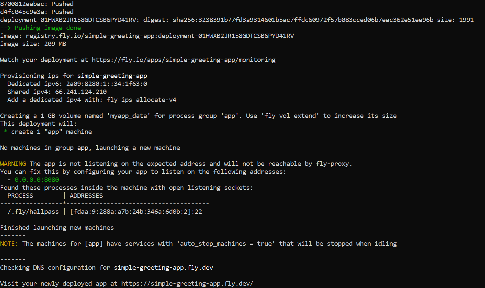

The warning about the app not listening on the right address still appears, but go to https://simple-greeting-app.fly.dev/ and see the app run!

### Success!
We can see our greeting on the web!<br>
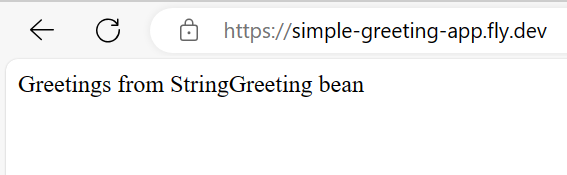
<br>
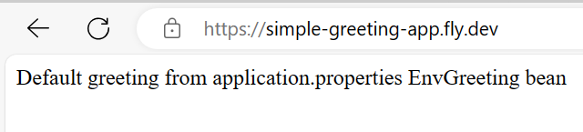

## More tweaking

fly.io offers some metrics and we can see that our app is only around 160.3 mb of ram. It is a simple app after all. <br>
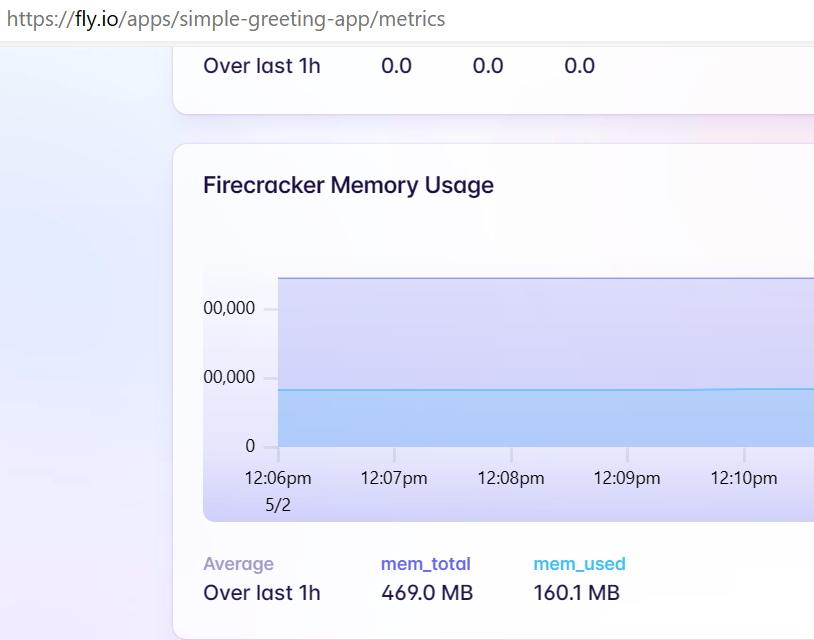

We also see that the `EnvGreeting` bean is just returning the default value since the environment variable `ENV_GREETING` was not set.<br>

### Setting Environment Variables
Edit the `fly.toml` file and add the block below
```
[env]
  ENV_GREETING = "Hello from EnvGreeting bean and fly.io"
```

After redeploying we can see that the `EnvGreeting` bean is returning the value we set in the `[env]` section of `fly.toml`.
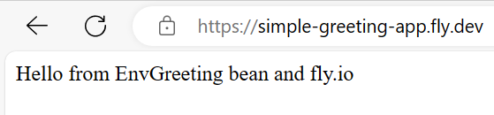<br>

### Lower the memory we are using on the fly.io machines
Edit the 'fly.toml' file
```
...
[[vm]]
  memory = '512mb' <---change to 256mb
  cpu_kind = 'shared'
  cpus = 1
...
```

Deploy the application again, from project root directory
```
fly deploy --local-only
```

From the memory metric we can see the dip after we changed the memory setting to 256mb in `fly.toml`.<br>
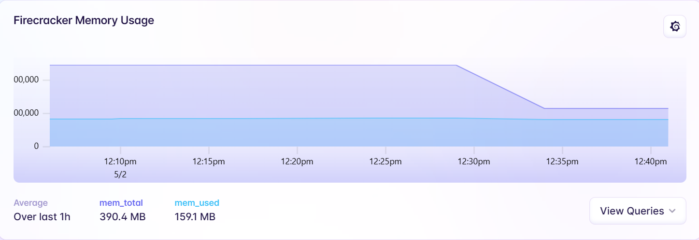<br>

## Adding some metrics

We need to be able to monitor the apps that we deploy remotely and an easy way to do that is to take advantage of the infrastructure that fly.io already provides. They have a good write up about it [here](https://fly.io/blog/measuring-fly/).

We need to add some dependencies and properties to our project for metrics to work. Some changes to `fly.toml' is needed as well to tell fly.io where to get our metrics.

### Dependencies for metrics

In build.gradle add the following to the dependencies section
```
dependencies {
...
	implementation 'org.springframework.boot:spring-boot-starter-actuator'
	implementation 'io.micrometer:micrometer-registry-prometheus'
...
}
```

### The code to collect the metrics

The changes to [GreetingController.java](./src/main/java/dev/mike/chao/simple/greeter/GreetingController.java) to add collection of metrics is as follows.

```
  private final Counter greetingCounter;

  public GreetingController(@Autowired MeterRegistry meterRegistry) {
    greetingCounter = Counter.builder("greetings.count")
        .description("Number of greetings given")
        .register(meterRegistry);
  }

  @GetMapping("/")
  String getGreeting() {
    int count = (int) greetingCounter.count();
    String greeting = (count % 2 == 0) ? stringGreeting.getGreeting() : envGreeting.getGreeting();
    greetingCounter.increment();
    return greeting;
  }
```

In the constructor the `MeterRegistry` is `@Autowired` in and we use the `Counter.builder` to build the `greetingCounter` object. The `greetingCounter` object is registered with the meterRegistry passed in by Spring.

Then in the getGreeting() method we increment the counter.

### Application properties to enable metrics

We also need to make some changes in `application.properties` to enable metrics and some additional endpoints from `spring-actuator`.
```
management.prometheus.metrics.export.enabled=true
management.endpoints.web.exposure.include=metrics,shutdown,logfile,prometheus
management.endpoint.shutdown.enabled=true
endpoints.shutdown.enabled=true
```

### Expose our metrics to fly.io

In 'fly.toml' add the following block to expose our metrics to fly.io
```
[metrics]
  port = 8080
  path = "/actuator/prometheus"
```

### Seeing our simple metric

After pushing the changes above to fly.io with the 2 commands below 
```
./gradlew clean bootJar
./fly deploy --local-only
```
there are 2 ways to view our metric.

We can use an app like Postman to hit the actuator endpoint that we expose.<br>
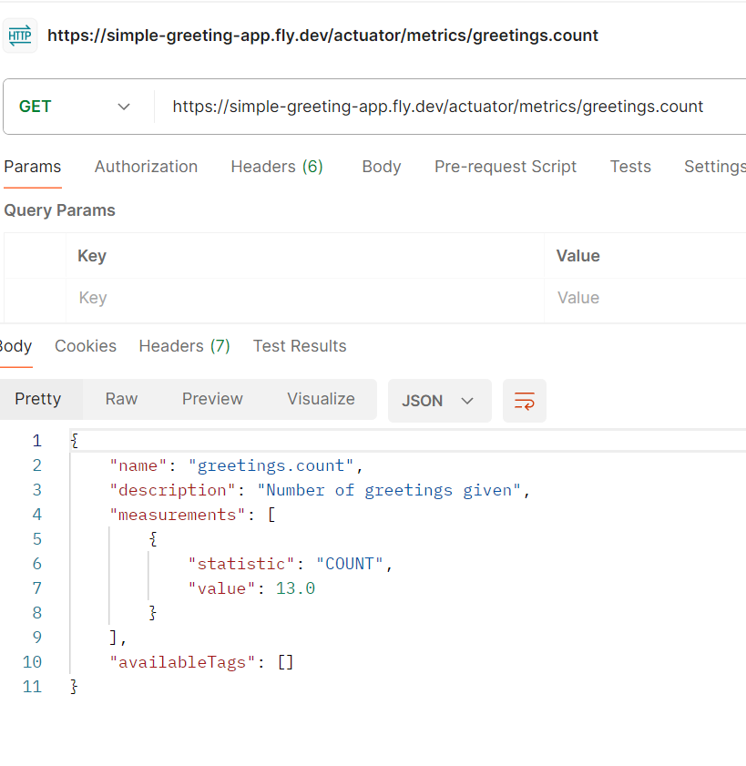
<br>

Or

Go to the metrics page for our app on fly.io and hit the Open all on Grafana button.<br>
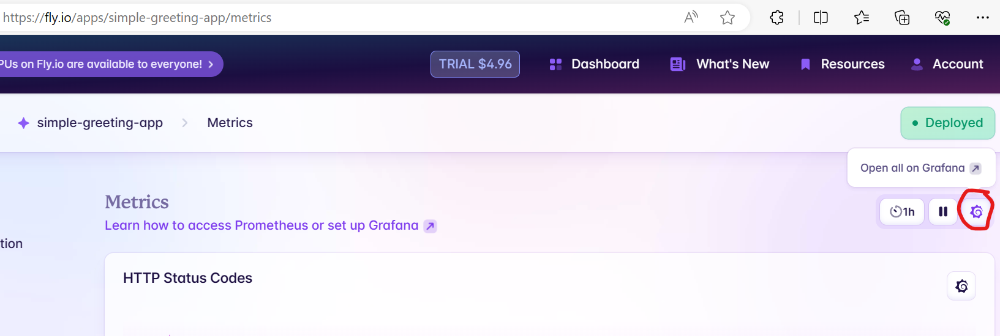
<br>

This will open [Grafana](https://grafana.com/) page for ALL our apps on fly.io. From here hit the hamburger menu on the left and select Data Source.<br>
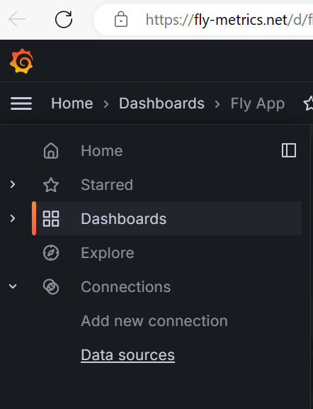

From the Data Sources page select the Explore button in the Prometheus on Fly section and it will open up the query builder.<br>
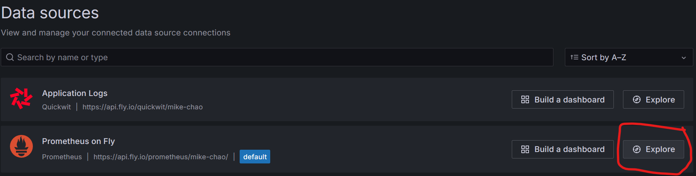

In the query builder page find our metric<br>
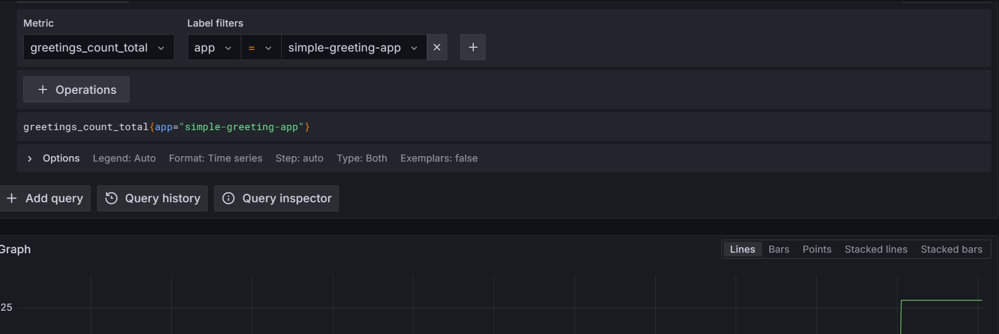

Then click add to Dashboard. Pick a Dashboard you want to add it to.<br>
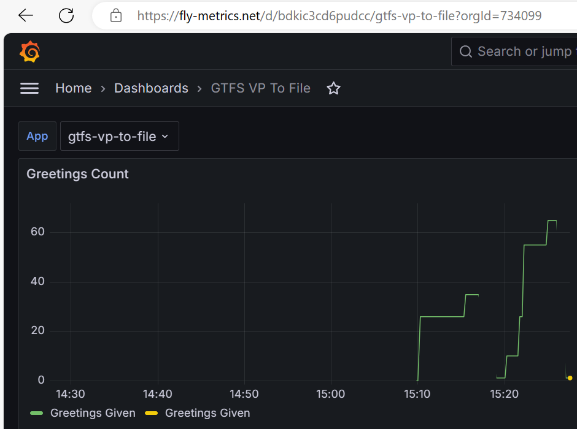
<br>
⚠️⚠️⚠️<br>
Notice the discontinuous line. This is because fly.io will suspend the machine when it's proxies detect that there is no traffic to the app.<br>
⚠️⚠️⚠️

## Some common fly.io CLI commands

Below are some helpful/common fly.io CLI commands. Most, but not all of the commands should be executed from the root directory of the project or where the 'fly.toml' is located.

List the information fly machines your apps are running on. One of the more important ones is the ID.
```
fly machine list
```

Stop a fly machine
```
fly machine stop $machineId
```

Start a fly machine
```
fly machine start $machineId
```

SSH into fly machine
distroless containers might not work???
```
flyctl ssh console
```

Getting files off the fly machines with SFTP shell
```
flyctl ssh sftp shell
```
Can navigate around with `ls`, use `get $fileName` to get a file. 
